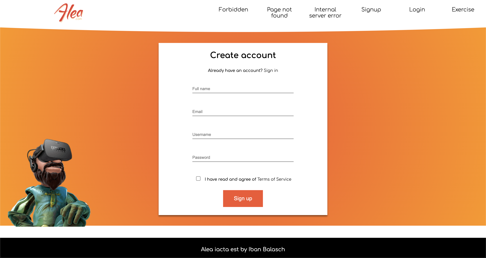
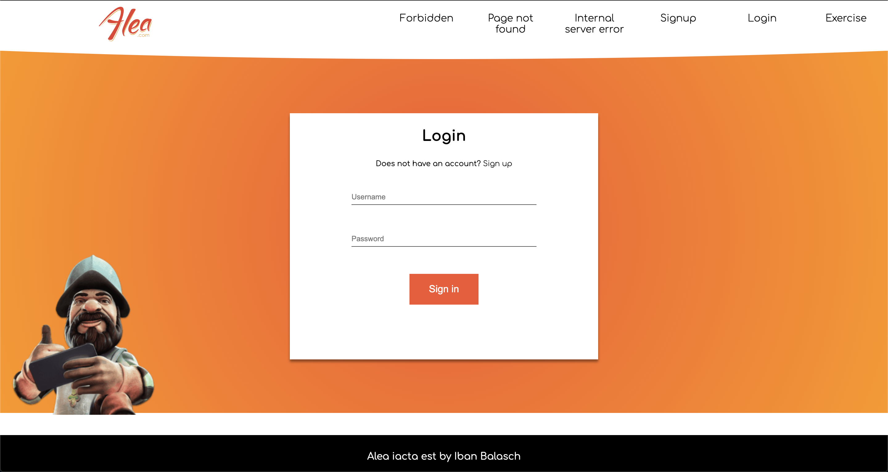
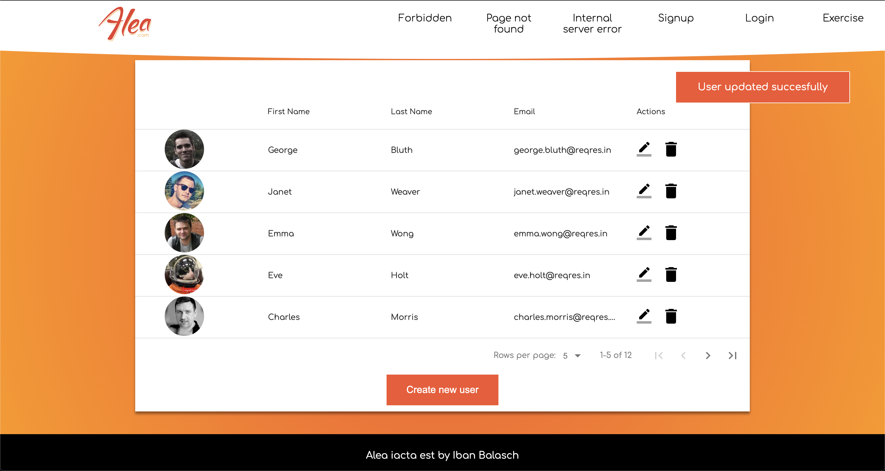
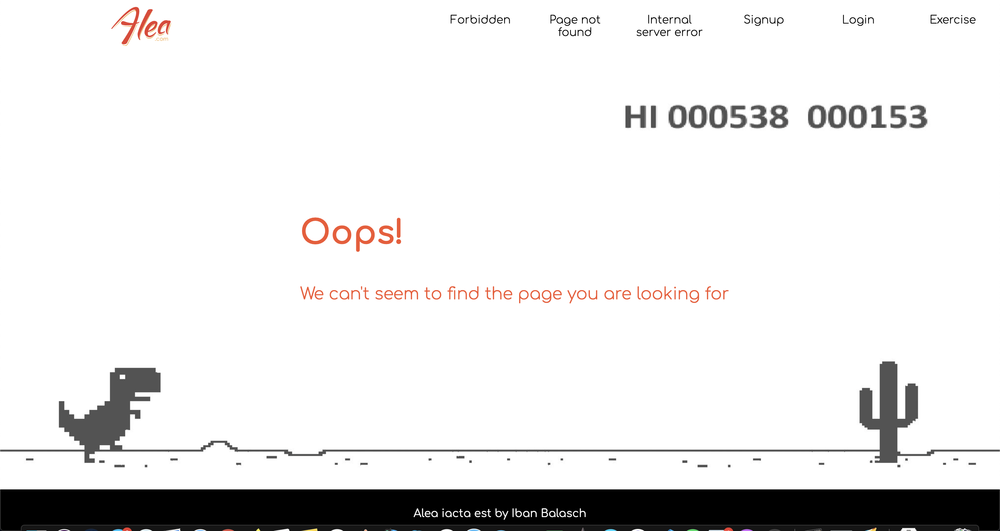
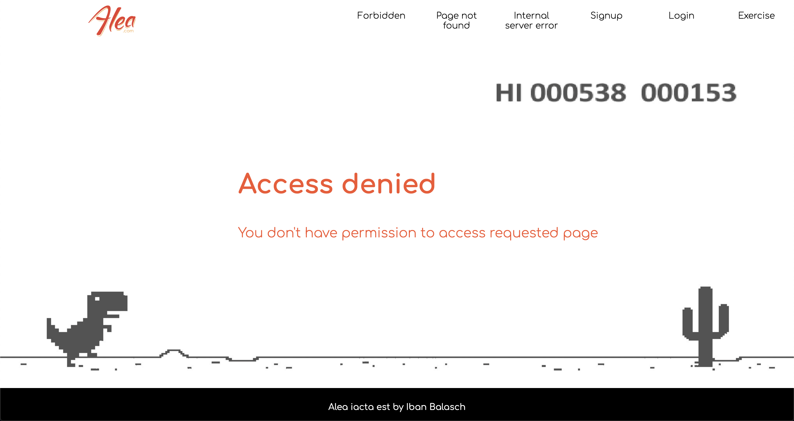
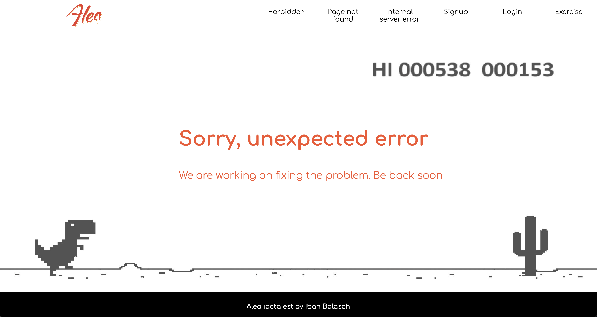

# Alea iacta est - Exercise

## Summary

### Requirements

- Create a Signup page.
- Create a Login page.
- Create a User Table List.
- Allow paginating on User Table List.
- Allow creating new Users.
- Allow editing User.
- Allow deleting User.
- Unit Testing
- Create custom error Pages (404, 403, 500)

### Comments

Something good to know before proceed:

- Used Typescript and SCSS as stack
- Didn't use any UI library
- Used some images from Alea homepage to look similar

#### Missing parts

- The sign up and sign in flow is not done due lack of time
- 404 page is used with react-router, miss to implement 403 and 500
- Fix jest error related with scss imports

#### What would you do if you had more time?

- This PoC was done in less than two days (just a couple of hours) so there are a lot of things to implement but, as an exercise and take a look about structure and code, will be fair enough
- Responsive design. Was developed in a 13" Macbook Pro without any UI library so this feature is missing
- Create the required unit tests for the components and redux objects. Right now, there are only two unit tests due lack of time. Must be incresed to reach the required coverage
- Complete the signIn-signUp flow to redirect to the example's page
- Create private routes to throw a 403 error page if the users is not authenticated
- Implement the 500 error page if the server throws an error (easy because we receive a 'failure' action)

#### Describe all the decisions that you take during the development

I was thinking about how was the best approach to do the typical flow splash screen -> login process -> CRUD operations, after taking into account the little time I had to do it, I focused in implement all the required screens and, the most important, focused in the CRUD page (Exercise). This project is not completed and it's a shame but I have tried to invest the time that I had doing examples of how I code, how I structure a project and just a small example about how to test a reducers and a component.

I invite you to take a look to another projects that I have in my Github's repository to see more examples :)

### Pages

#### Splash screen

On this screen you will find all the routes available for this PoC to allow navigate between the screens 'easily'.

#### Sign up screen

Appears two links, the first one is to move to the sign in screen in case that the user has an account, the other one is to show the terms of service page (not implemented)

#### Sign in screen

Same above, appears one link to move to the sign up screen in case the user doesn't have a valid account.

#### Exercise screen

On this screenshot you will see, in the right side, the implementation of a snackbar to show the succesfull state of create, update or delete an user.

#### 404 screen

Using the 'famous' T-Rex from Chrome, created the 404 page. This component is the same for 403, 404 and 500, only changes the title to show.

#### 403 screen

#### 500 screen

